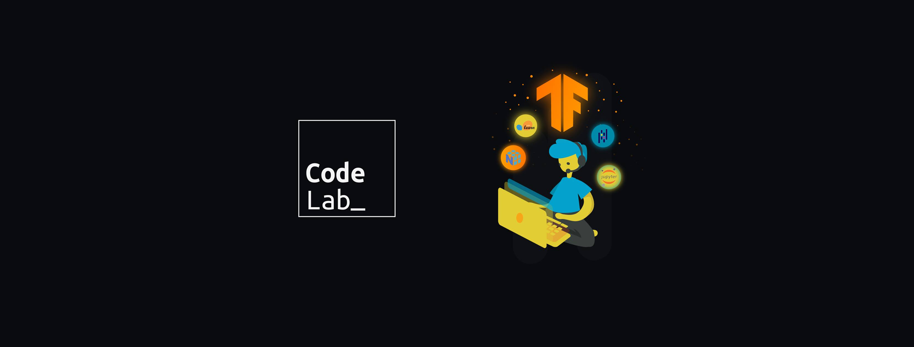

# Code Lab ML - Lecture Notes

This repository contains the lecture notes of Code Lab's Introduction to Machine Learning course.

### Week 1

Introduction to Python basics and 3rd party libraries that are used in Machine Learning and Data Science like Numpy, Pandas and Matplotlib.

### Week 2

Introduction to Scikit Learn, a Machine Learning library, with focus on Linear/Logistic regression algorthims.

### Week 3

More Scikit Learn, with focus on the Support Vector Machine algorthim, evaluation metrics, cross-validation and hyper parameters tuning using Grid Search.

### Week 4

Introduction to TensorFlow and Fully Conntected Neural Networks

### Week 5

Continuting with TensorFlow with a focus on computer vision using Convolutional Neural Networks and using pretrained models with Transfer Learning.

### Week 6

More TensorFlow with focus on sequence and text data using Recurrent Neural Networks and Long-Short-Term Memory Cells (LSTM), as well as hyper parameters tuning using KerasTuner.
